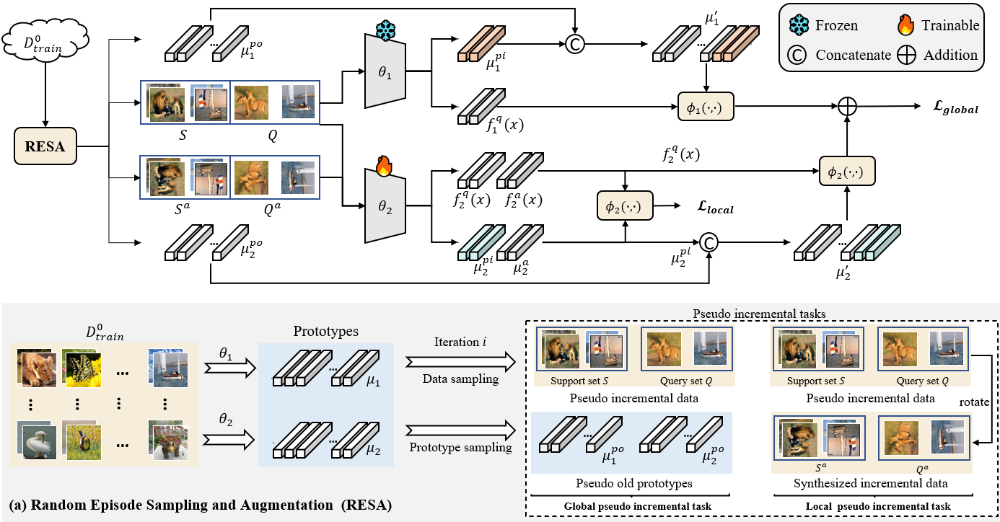

# Knowledge Transfer-Driven Few-Shot Class Incremental Learning

## Few-shot class incremental learning (FSCIL) aims to continually learn new classes using a few samples while not forgetting the old classes. To address this issue, we propose a Random Episode Sampling and Augmentation (RESA) strategy that mimics the real incremental setting and constructs pseudo incremental tasks globally and locally to coincide with the learning objective of FSCIL and further improve the model's plasticity, respectively.Furthermore, to make convincing incremental predictions, we introduce a complementary model with a squared Euclidean-distance classifier as the auxiliary module, which couples with the widely used cosine classifier to form our whole architecture.

# 1. Prepare the data
- First, download the whole datasets <datasets.tar.gz> from Baidu Netdisk.

    Link：https://pan.baidu.com/s/1jBVGyR-L6gLHLvw-OBnoww 

    Code：z00o 

- Then, unpack <datasets.tar.gz>.

   $ tar -zxvf datasets.tar.gz

# 2. Prepare the model
- First, download the pretrained models and our trained models <experiments.tar.gz> from Baidu Netdisk.

    Link：https://pan.baidu.com/s/13WtBhtvEnVRp5QJCCnjDWQ 

    Code：xmoo 

- Then, unpack <experiments.tar.gz>.

   $ tar -zxvf experiments.tar.gz

# 3. Test our model directly or train

## 3.1 Test our proposed method directly
（1）miniImageNet：

$ bash scripts/mini/mini.sh

(2) CIFAR100

$ bash scripts/cifar/cifar.sh

(3) CUB200

$ bash scripts/cub/cub.sh

## 3.2 Train our proposed method
（1）miniImageNet：

set the argment 'train_flag' True, then run

$ bash scripts/mini/mini.sh

（2）CIFAR100：

set the argment 'train_flag' True, then run

$ bash scripts/cifar/cifar.sh

（3）CUB200：

set the argment 'train_flag' True, then run

$ bash scripts/cub/cub.sh

